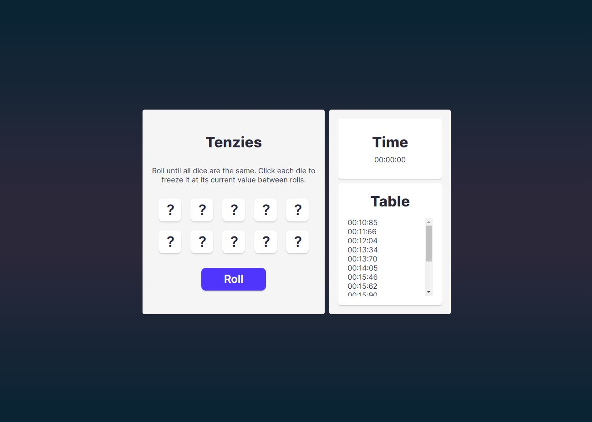
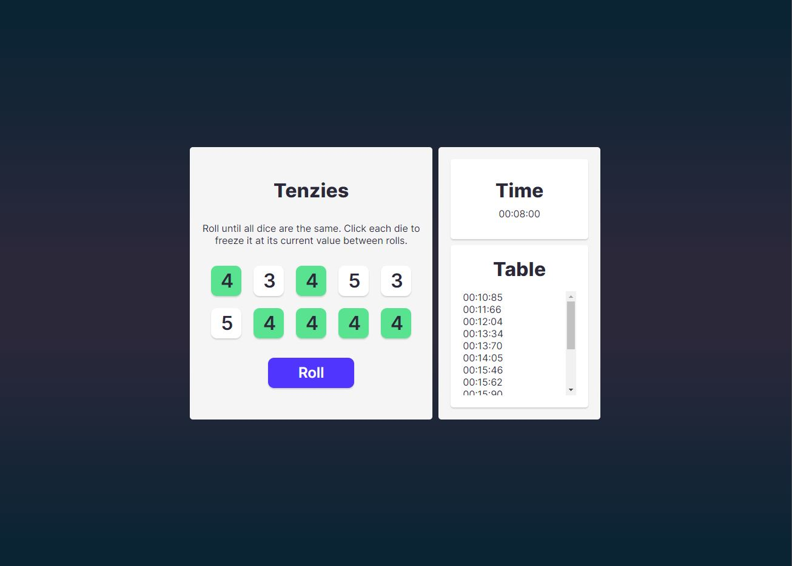
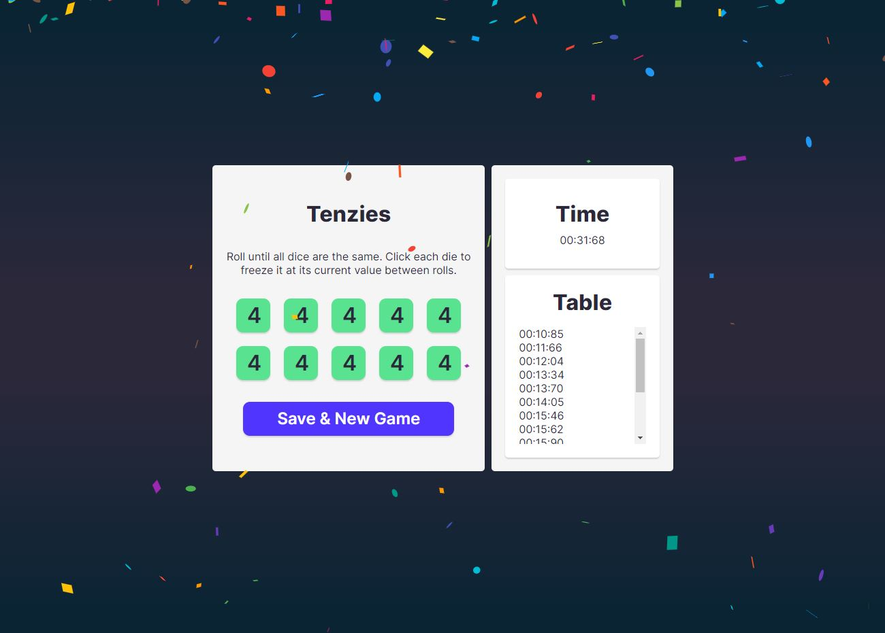

React Tenzies Game

Link to live-site:
https://blankapi.github.io/Tenzies-game/

Simple dice game where user rolls until all dice are the same. 
Click each die to freeze it at its current value between rolls.
Time is measured and saved in local-storage in ascending order. 

